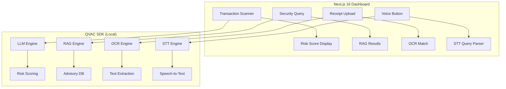

# Qguard — Technical Architecture

## Tech Stack
| Layer | Technology |
|---|---|
| **Frontend** | Next.js 16 (App Router), React 19 |
| **Styling** | Tailwind CSS v4 |
| **AI Runtime** | QVAC SDK (LLM + RAG + OCR + STT) |
| **Database** | Supabase (demo data) or local SQLite |
| **Charts** | Recharts |

## System Architecture

## QVAC SDK Integration Map
| Feature | Use Case | Endpoint |
|---|---|---|
| **LLM** | Transaction risk analysis | `qvac.llm.analyze()` |
| **RAG** | Security advisory lookup | `qvac.rag.query()` |
| **OCR** | Receipt text extraction | `qvac.ocr.extract()` |
| **STT** | Voice-to-query conversion | `qvac.stt.transcribe()` |

## API Routes
| Method | Path | Description |
|---|---|---|
| POST | `/api/scan` | Score transaction risk via LLM |
| POST | `/api/advisory` | Query security advisories via RAG |
| POST | `/api/receipt` | OCR receipt → match transaction |
| POST | `/api/voice` | STT transcribe → parse query |
| GET | `/api/transactions` | List demo wallet transactions |
